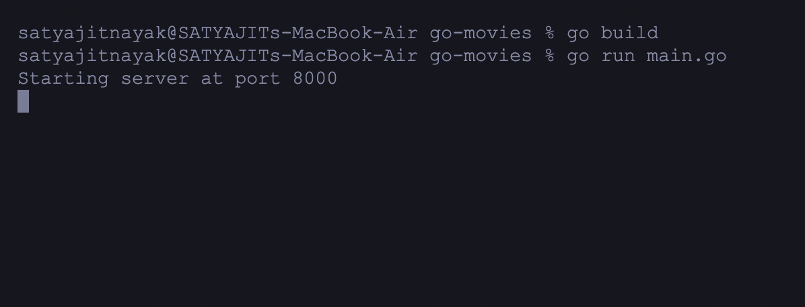
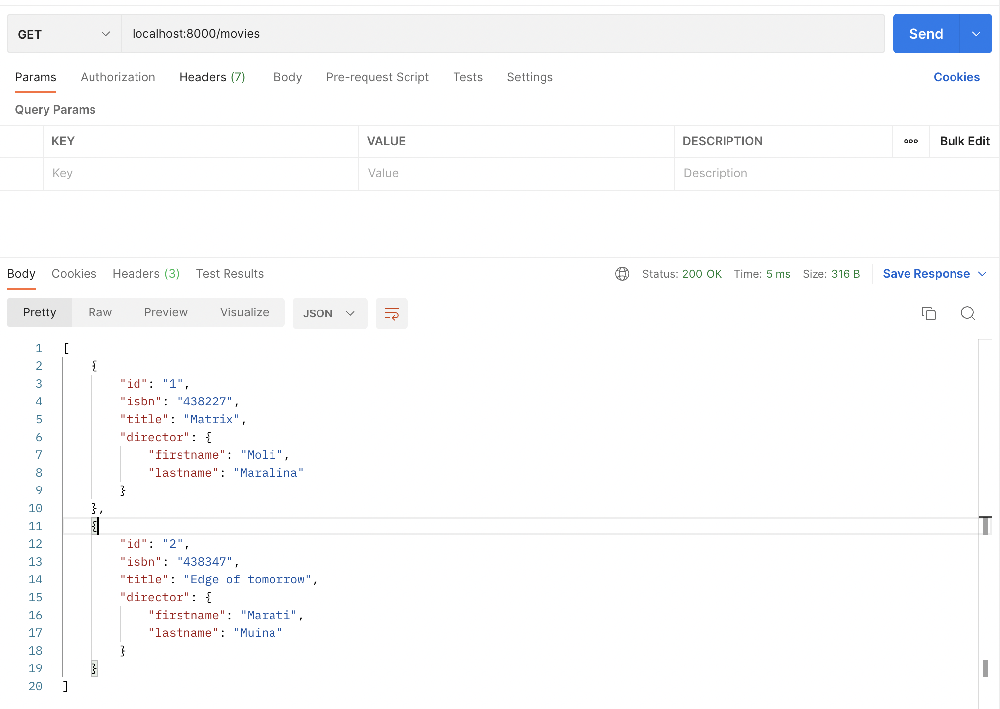
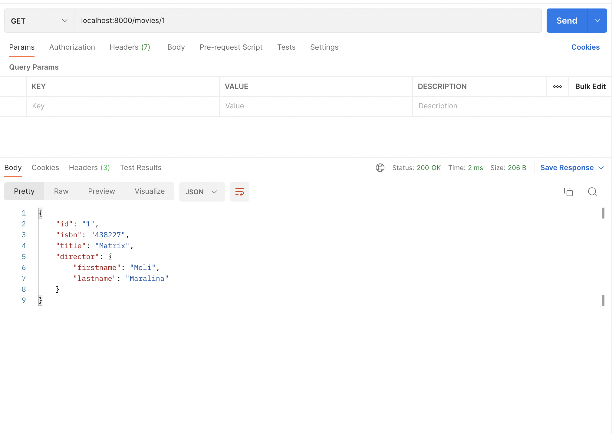

1. You can use this as learning how to make basic rest apis using go lang. 📖
2. In the project directory use the following commans to run the code
   go build
   go run main.go

3. screen shots of apis in postman

## Server Running

## get Movies

## get Movie by ID

